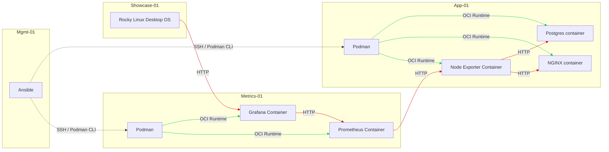

```mermaid
---
config:
  layout: dagre
---
flowchart LR
 subgraph s1["Metrics-01"]
        n1["Prometheus Container"]
        n9["Grafana Container"]
        n13["Podman"]
  end
 subgraph s2["App-01"]
        n4["NGINX container"]
        n5["Postgres container"]
        n11["Podman"]
        n12["Node Exporter Container"]
  end
 subgraph s3["Mgmt-01"]
        n3["Ansible"]
  end
 subgraph s4["Showcase-01"]
        n14["Rocky Linux Desktop OS"]
  end
    n9 -- HTTP --> n1
    n11 -- OCI Runtime --> n5 & n4 & n12
    n12 -- HTTP --> n5 & n4
    n1 -- HTTP --> n12
    n13 -- OCI Runtime --> n9 & n1
    n14 -- HTTP --> n9
    n3 -. SSH / Podman CLI .-> n11 & n13

    n3@{ shape: rect}
    linkStyle 0 stroke:#D50000,fill:none
    linkStyle 1 stroke:#00C853,fill:none
    linkStyle 2 stroke:#00C853,fill:none
    linkStyle 3 stroke:#00C853,fill:none
    linkStyle 4 stroke:#D50000,fill:none
    linkStyle 5 stroke:#D50000,fill:none
    linkStyle 6 stroke:#D50000,fill:none
    linkStyle 7 stroke:#00C853,fill:none
    linkStyle 8 stroke:#00C853,fill:none
    linkStyle 9 stroke:#D50000,fill:none
```
