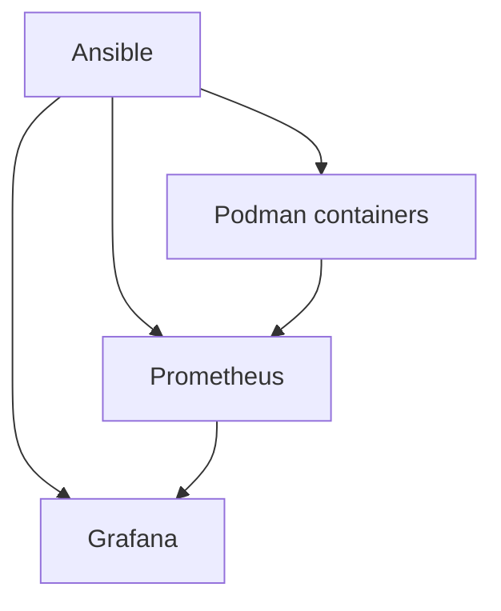
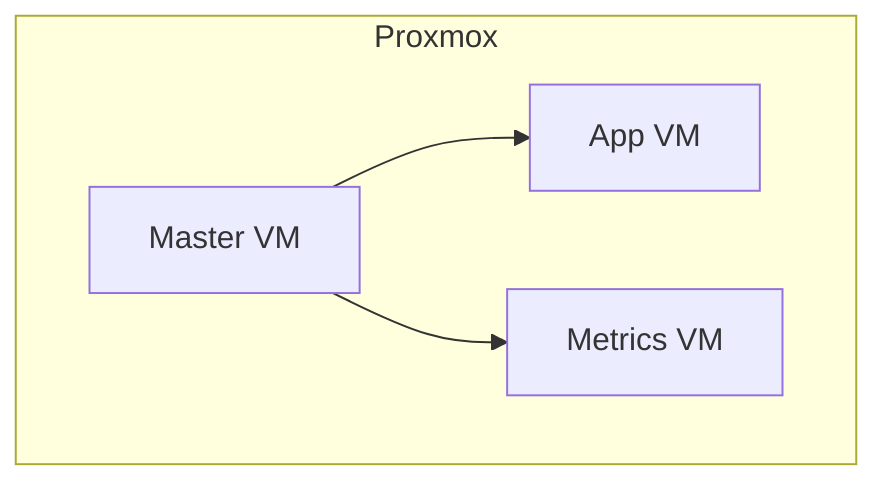

# Container Stack Deployment With Ansible 
 

**Container Stack Deployment With Ansible**
 **Authors:** _<a href="https://github.com/Filipanderssondev">Filip Andersson</a> and <a href="https://github.com/JonatanHogild">Jonatan Högild</a>_ 
Publiceringsdatum 
 

## Abstract
Container stack / application Deployment on virtual machines running Podman, through a control vm running ansible. Fourth project <a href="https://github.com/rafaelurrutiasilva/Proxmox_on_Nuc/blob/main/Extra/Mermaid/Projects.md">in a series of projects</a> during our internship at **The Swedish Meteorological and Hydrological Institute** [(SMHI)](https://www.smhi.se/en/about-smhi), Deploying an application with podman compose on an application vm we created.  
 

## Table of Contents

1. [Introduction](#introduction)
2. [Goals and Objectives](#goals-and-objectives)  
    2.1.[Structure](#Structure)
4. [Method](#method)
5. [Target Audience](#target-audience)
6. [Document Status](#document-status)
7. [Disclaimer](#disclaimer)
8. [Scope and Limitations](#scope-and-limitations)
9. [Environment](#environment)
10. [Acknowledgments](#acknowledgments)
11. [References](#references)
12. [Conclusion](#conclusion)
 

## 1. Introduction 
**Welcome friend!**
_...to this project where i am going to do some container deployment through infrastructure-as-code (IaC) with Ansible. Im going to deploy an application / stack of containers on two worker VMs, the application VM will serve as our runtime enviroment and the metrics VM serving as our metrics collector / Monitoring for that app, running Prometheus and Grafana. I will run everything on the VM called management, that will serve as our control VM running Ansible. I will do this by configuring Ansible Roles, and using those ansible roles in playbooks. This is our fourth project <a href="https://github.com/rafaelurrutiasilva/Proxmox_on_Nuc/blob/main/Extra/Mermaid/Projects.md">in a series of projects</a> with the end goal of setting up a complete virtualized, automated, and monitored IT-Enviroment as a part of our internship on [The Swedish Meteorological and Hydrological Institute (SMHI)](https://www.smhi.se/en/about-smhi) IT-department at the headquarters in Norrköping. The second goal of these projects are also supposed to serve as a set-up guide here on Github for anyone and everyone that wants to replicate what we have done. we will link every project to each other aswell._ 

**<a href="https://github.com/Filipanderssondev">Filip Andersson</a> and <a href="https://github.com/JonatanHogild">Jonatan Högild</a>**
 
 

## 2. Goals and Objectives
The goals and objectives of this project is: 
- To run an application on the application VM, hosting it on port 8080
- Collect metrics from that app to the metrics VM, displaying it in Grafana.
- Doing it all through Ansible on the management VM
 

### 2.1 Structure
As i described in the beginning im going run a container stack / application on the application vm, monitor that application and display the metrics on the metrics vm. I will manage everything through our control vm called Management through Ansible, using roles in playbooks.

  **For the container stack i will run:**
  - NGINX as frontend, displaying basic HTML/CSS
  - Postgres as a database
  - Python as backend
 
  **For monitoring i will run:**
  - Prometheus
  - Grafana
  - Node-exporter on all vms as exporter

Management VM:
 - Ansible roles
 - Ansible Playbooks

Application VM
 - Running Podman as runtime enviroment
 - Running the application

- Note, that some details cant be disclosed due to company policy and that i will speak in general terms. For example the registry i will pull images from i will call _"private-registry.com/repository"_
 

## 3. Method

Draft:
- My method or approach is mostly developer driven since i am a developer/programmer aswell and started that way. I chose NGINX mostly because its reliable and easy to spin up. I chose Postgres mainly because it felt like the most relevant choice of database for this day an age and this kind of project and i wanted to try it, i am more used to "key=value" file based databases.

- Why i decided to run HTML/CSS, Python Backend and Postgres is because i felt i want to have something more advanced for my NGINX Container to host, and something more advanced for Prometheus and Grafana to collect metrics from.

### 3.1 Preparation 
- We have our earlier projects as a foundation, [a Server running Proxmox](https://github.com/rafaelurrutiasilva/Proxmox_on_Nuc/tree/) and proxmox running [three replicated virtual machines from a Rocky Linux OS base](https://github.com/Filipanderssondev/Rocky_Linux_OS_Base_for_VMs) and [Ansible configuration on the management vm](https://github.com/JonatanHogild/Ansible_on_management_vm)

 

### 3.2 Ansible Roles configuration on Management VM
For each role, i will create a deafults/main.yaml and a tasks/main.yaml as is the standard to have a defaults as fallback and a tasks/main.yaml to descrive how things will be executed, and in playbooks what will be executed. I choose to create reusable roles as it is less repetative then writing tasks in playbooks.

- I will need a role for logging into the private registry
- I will need a role for checking that enviroment tools like podman exists 
- I will need a role who pulls images, run applications.

My project structuer will look something like this:
 
~~~yaml
ansible/roles
├── containers
│   ├── images
│   │   └── pull
│   │       ├── defaults
│   │       │   └── main.yaml
│   │       └── tasks
│   │           └── main.yaml
│   ├── install
│   │   └── tasks
│   │       └── main.yaml
│   ├── login
│   │   ├── filip
│   │   │   ├── defaults
│   │   │   │   └── main.yaml
│   │   │   └── tasks
│   │   │       └── main.yaml
│   │   └── jonatan
│   └── run
│       ├── defaults
│       │   └── main.yaml
│       └── tasks
│           └── main.yaml
├── applications
│   ├── app
│   │   ├── backend
│   │   ├── db
│   │   ├── frontend
│   │   └── run
│   │       ├── defaults
│   │       │   └── main.yaml
│   │       └── tasks
│   │           └── main.yaml
│   └── monitoring
│       └── run
│           ├── defaults
│           └── tasks
~~~

#### 3.2.1 Log in Role

 

#### 3.2.2 Installation role

 

#### 3.2.3 image Pull role

ansible/roles/containers/images/pull/defaults/main.yaml
~~~yaml
---
default_registry: "private-registry.com/repository"

#image basics
image_name: ""
tag: "latest"
tlsverify: false

#manufacturer if needed like prom/prometheus:latest
manufacturer: ""

images_to_pull:[]
~~~

ansible/roles/containers/images/pull/tasks/main.yaml

~~~yaml
---
- name: Pull images
  containers.podman.podman_image:
    name: >-
      {{
        default_registry
        + '/'
	+ (item.manufacturer ~ '/' if item.manufacturer is defined else '')
        + item.image_name
        + ':'
	+ (item.tag | default(default_tag))
      }}
    state: present
    tlsverify: "{{ tlsverify }}"
  loop: "{{ images_to_pull }}"
~~~

 

#### 3.2.3 Application roles

 

#### 3.2 Deploying the application
N/A
draft:

##### Debug
N/A

 

## 4. Target Audience
- This repo is for anyone who wants a step-by-step guide on .
This repo is also part of a larger project aimed at people interested in learning about IaC, and building such an environment from scratch. 
  

## Document Status
> [!NOTE]  
> This is an ongoing work right now

## Disclaimer
> [!CAUTION]
> This is intended for learning, testing, and experimentation. The emphasis is not on security or creating an operational environment suitable for production. 

## Scope and Limitations

### Scope
- The scope is inteded to serve as an internship project and learning oppertunity when it comes to working with containers, and to run applications on our virtual machines with redundance

### Limitations
- Naturally we have strict limitations for what we can specify and not. We only specfify public information and our general approach.

## Environment
- [See our foundation from earlier projects](###Our-other-projects)

## Acknowledgments
Great thanks once again to our mentor [Rafael](https://github.com/rafaelurrutiasilva) and [Victor](https://github.com/ludd98) for helping with 

## References
- [Dockerhub (public image repository](https://hub.docker.com/)

### Our other projects
1. [Proxmox_on_Nuc](https://github.com/rafaelurrutiasilva/Proxmox_on_Nuc)
2. [Rocky_Linux_OS_Base_for_VMs](https://github.com/Filipanderssondev/Rocky_Linux_OS_Base_for_VMs)
3. [Ansible_on_management_vm](https://github.com/JonatanHogild/Ansible_on_management_vm)
4. [Podman_Compose_app_on_VMs](https://github.com/Filipanderssondev/Podman_Compose_app_on_VMs)

## Conclusion
Slutsats
